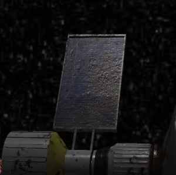
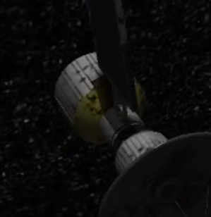
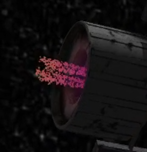
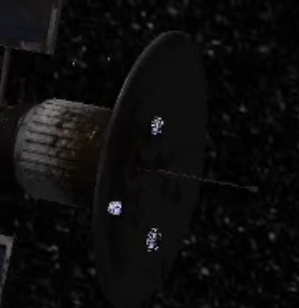

# INFO H502 - Technical subjects on virtual reality
## Introduction

### Build 

Dependencies: Opengl, Glew, glfw3, glm, assimp.
External project used: stbImage.

The code is provided with the CMake build system

### Milestone reached

In the context of a object spinning on himself illuminated by a distant light source

- Loading a obj/mtl file
- Implementing shader that use the Phong reflection model 
- Exploiting the content of normal map

- Render the light viewpoint into a depth map to add shadows to the scene

- Textured cube-map around the object
- Particle streams vaguely imitating a thruster flame

- Non realistic weather-like particle system to create context for collision.
- Particle collision with a dish (modelled as a cylinder), the particle stop at an adequate position and do not clip the model ( interpolated and fixed position inside the model box)
- Geometry shader create a explosion effect from a cube using subdivision of triangle primitive.

### Program usage

- Choose camera preset using directional arrows
- Activate camera auto-motion by pressing enter and stop it by pressing backspace
- Orientation and fov using the mouse
- Press Esc to quit

## Code Highlights

### Shadow

The main configuration for computing the depth map is done in the main function where an orthonormic frustrum that represent the reach of the distant light(from the sun) is defined.
Attention is given towards having a good resolution of the object/scene in order to avoid a loss of information and towards adjusting the dimensions to include any point that we may later sample to avoid shadow replication.

As mentioned in the documentation the shader and framebuffer are simplified for the depth computation and the result is stored in a texture loaded at slot 0.
The reference Model class has been modified to allow this slot to be unused.

Then the combined view and projection matrix is passed as a uniformed to the main shader and used in conjunction with the Model matrix to sample the depth map.
A shadow acne is present and required a small bias to provide a good result.

### Particle stream

Both streams (weather and thruster) use instantiation of a cube and a buffer for color and position.
Each buffer is separately rewritten with a dense data structure in the form of a vector of glm::vec3 to account for particle evolution.
An optimisation could be to only update one buffer with a vec6 and set the accordingly the pointer to provide color and position in one write operation.
Another possibility would be to send only the life of the particle to the vertex shader and let him interpolate relative position and color from a uniform-given origin.

Look and feel have been configured using had hoc number dispersed in shader and dedicated code, reusing the code is not possible.
For the thruster the particle stream is visually enhanced by a diffuse lightning in the object shader that act as if the particles were emitting light

### Geometric explosion

The idea is to create a visual explosion effect if a particle hit the object. 
To do that the geometric shader subdivide a triangle primitive in 3 using the computed centroid as a new vertex. 
Then the shader creates 3 new primitive(simulating shards) that are expanding radially from the particle center.
The expansion is controlled by the particle life as defined in the processor.

Shard that may have clipped the object have been redirected using a magic condition to provide a quick visual enhancement. 

### Collision management

To ease the development a unidirectional weather has been generated to create a simple point to cylinder detection.
Implemented using empiric and magic number obtained via render Doc the particles that collide withe the object are clipped to an esthetically appropriate position interpolated from they original position.
From that point a count down is started that trigger the geometry shader and the later elimination of the particle.

## Opportunities 

- Rendering a rotating asteroid in a framebuffer to provide dynamic cubemap would have been a nice touch
- The code has been developed with in mind a one shot much can be done to improve it's quality.
- Spatial movement for the camera has been really neglected because it was not opengl related and could use a little attention.
- Light source for the planet could have been added but felt like a repetition of technology already demonstrated.
- Another object could have provided interesting opportunities for animation.

## Credits

A lot of work have been put into those website that have given most of the pedagogic resources for the success of this work.

- http://www.opengl-tutorial.org/
- https://learnopengl.com/

The quality of resource make the job a lot easier, many thanks to the man behind this profile for the 3D and paint job made available for free:

- https://free3d.com/user/marcianozx

The lab session were always instructive and enjoyable thanks to Daniele Bonatto.

The course subject provided me with adequate opportunities to motivate the work thanks to Prof Lafruit

 